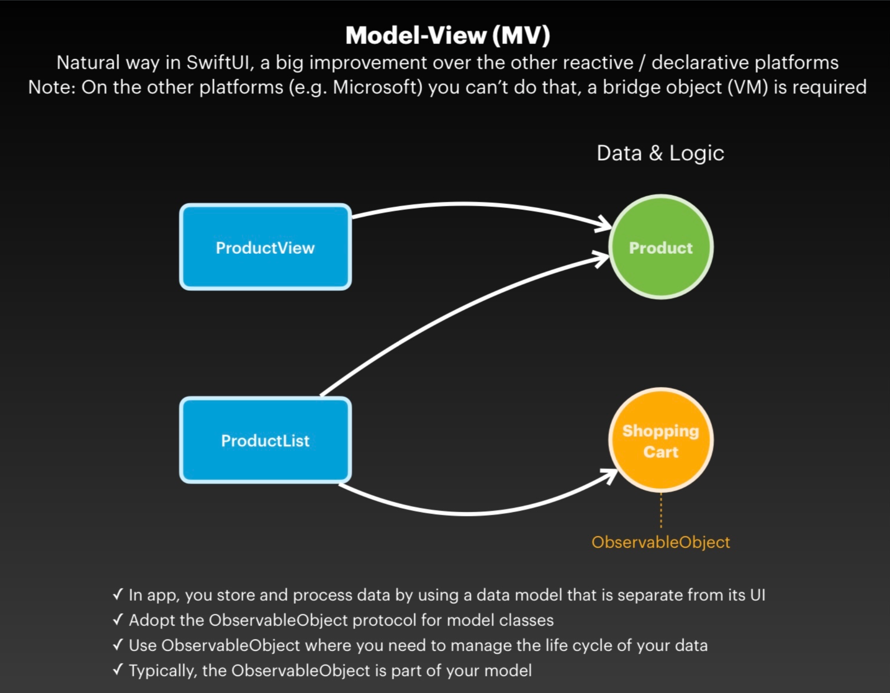
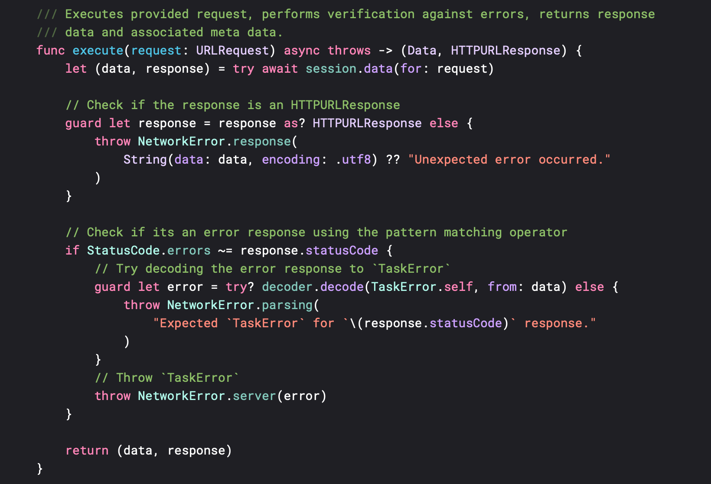

# Todo

A **native iOS** app developed using **SwiftUI** that allows the user to manage tasks on a to-do 
list. This app utilizes the **[Todo API](https://github.com/hauntarl/todo-api) REST** service for 
performing all the **CRUD** operations.

> 
> 
> 

## 💅🏼 About

- Developed by **[Sameer Mungole](https://www.linkedin.com/in/sameer-mungole/)**
- Design Specifications: [Figma](https://www.figma.com/file/eH8JMqomFAgHsGgb4B50QO/Pages?type=design&node-id=0-1&mode=design)
- API Specifications: [API.md](https://github.com/hauntarl/todo-api/blob/main/Docs/API.md)

### Project
- XCode Version **15.3 (15E204a)**
- Minimum deployment: **iOS 17.4**
- Tested on **iPhone 15 Pro** (Simulator)
- Supports **portrait-up** device orientation

## 📲 How To

> **NOTE:** For this application to work it is important that the **API** service is running at
> [http://localhost:5181](http://localhost:5181), refer the 
> [Todo API](https://github.com/hauntarl/todo-api/blob/main/README.md) instructions to know more
> about setting up the service to receive requests.

### Service

Start the **API service** in `http` mode:
```console
% dotnet build
% dotnet run --project Todo
```

Verify whether the service is up and running via:
- **Swagger:** [http://localhost:5181/swagger/index.html](http://localhost:5181/swagger/index.html)
- **Rest Client:**
    - Navigate to [Requests/](https://github.com/hauntarl/todo-api/tree/main/Requests) folder, 
      open files with the `.http` extension.
    - You should see a `Send Request` button on top of your **HTTP Request** definition.
    - Click `Send Request` button to see the **HTTP Response** in a new tab.

> **NOTE:** For using the **Rest Client**, make sure you have the 
> [Rest Client](https://marketplace.visualstudio.com/items?itemName=humao.rest-client) plugin 
> installed on your **VS Code**.

For more information go through the [README.md](https://github.com/hauntarl/todo-api/blob/main/README.md) 
for the **Todo API**.

### Application

> **IMPORTANT:**

As the **API** is currently using **in-memory** database, the following method pre-populates the 
database with some sample tasks, intentionally done for **Demo** purposes.
```swift
private func createSamples() async {
    await withTaskGroup(of: Void.self) { group in
        for item in NewTask.samples {
            group.addTask {
                await manager.create(task: item)
            }
        }
    }
}
```
This method creates several new tasks with random due dates, and executes **POST** requests on the
**API service** for each task, concurrently. It is called **conditionally** only when the service 
doesn't have any tasks. So, relaunching the app while the service is active won't create duplicate 
tasks.

To **disable** this behavior, comment or delete the highlighted if-block from 
*[LaunchView.swift](Todo/Views/LaunchView.swift)*.


## 🏛️ Architecture

> 
> 
> 
> 

I've followed the **[Model View (MV)](https://betterprogramming.pub/swiftui-architecture-a-complete-guide-to-mv-pattern-approach-5f411eaaaf9e)** 
architecture for this application. This decision was inspired from the 
**[Stop using MVVM for SwiftUI](https://forums.developer.apple.com/forums/thread/699003)** post on
Apple's developer forum.



Source: [Stop using MVVM for SwiftUI](https://forums.developer.apple.com/forums/thread/699003)

### Design

I can very proudly say that I've followed the 
**[figma](https://www.figma.com/file/eH8JMqomFAgHsGgb4B50QO/Pages?type=design&node-id=0-1&mode=design)**
design to the *tee*, from icons and spacing to fonts. I have attempted to create a one-on-one 
replica of the provided design with a few exceptions (yes, to improve the overall **user experience**):

- I've kept the **title size and spacing** from top for `Settings, Create, and Edit` same as 
  `Task List` for consistency.
- I've added a `< Back` button to allow users to navigate back to the previous screen, without it,
  the users would've been forced to perform a correct `Save` operation.
- I've added a **Launch Screen** to the application to hide app's initial setup.
- I've added a small pop-up message that is displayed at the bottom when an error occurs in the app.
- I've added animations and transitions wherever possible to fluidly highlight user's interactions
  within the app.
- I couldn't match the provided calendar component as I've opted to use the native iOS calendar.

> **Comment:** Jordan mentioned how critical it is that the developers treat the provided design as
> holy-grail. That every change in the UI first needs to be approved by the **Design** team, made
> available through **Figma**, and only then the developers should incorporate those changes in the
> application. And I've made sure to follow it in order to highlight my **professionalism**.

As far as non-functional requirements are concerned. I've made sure to write proper doc comments
explaining the usage of that component. Added helpful comments wherever necessary to highlight
the flow and purpose of that functionality.


I've done extensively error handling to improve the robustness of the application.



I've also used `#Previews` while building and testing different parts of the user interface.
But couldn't provide a complete mock environment due to time-constraints.


## 🎴 Resources

- App icon, images, and colors - [Figma](https://www.figma.com/file/eH8JMqomFAgHsGgb4B50QO/Pages?type=design&node-id=0-1&mode=design)
- Inter Font by *Google Fonts*: [License](https://fonts.google.com/specimen/Inter)
